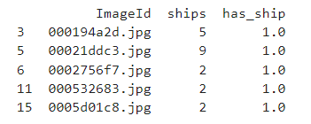
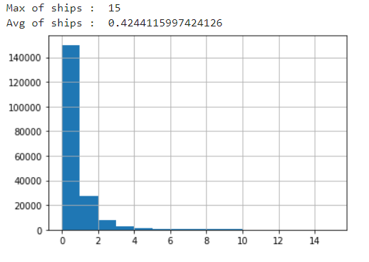
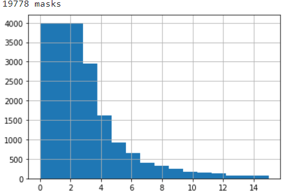
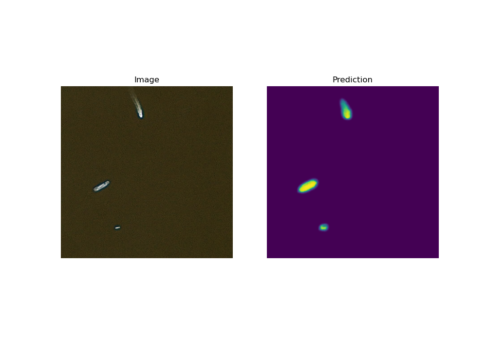
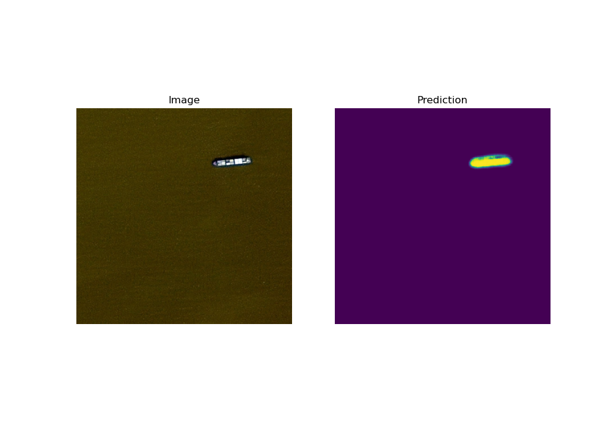
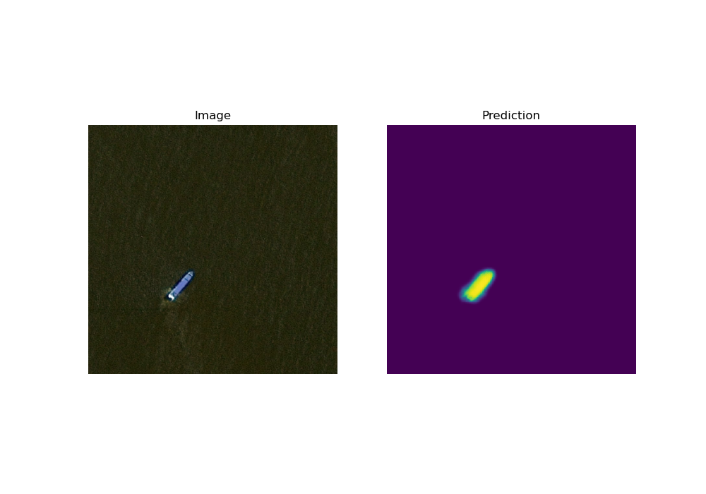
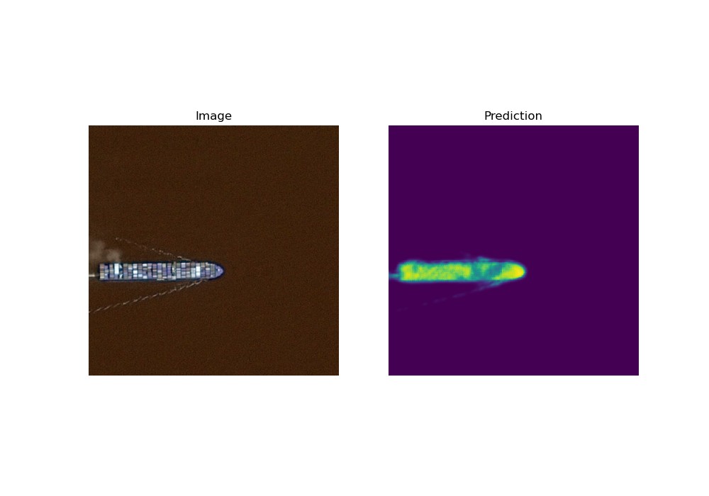

# Airbus-Ship-Detection-Challenge Introduction

Abstract: this repo includes a pipeline using tf.keras for training UNet for the problem of ships detection. Also it include many little problems which I did not have time to fix X)
**I used notebooks/train.ipynb as a main file for work. As for me, notebook is better for understanding, cause it's sectioned and named ;)**
*Also, I explained and commented most of the steps, since this test is designed more for training - therefore, I recommend considering it the ipynb notebook*
*+ I've had a problem with testing, for some reason the saved model does not work correctly in model with dice coefficient. I didn't have enough time to fix the problem: Model testing (with dice coeff) works only in train notebook*


### Dataset analysys 

By reason of not balanced dataset, first of all, we need to create a new database with amount of ships for each picture and binary counter (column has_ship).



 let's also visualize to see if it's really unbalanced:

 
 
 To deal with, we will extract 4000 or less samples per each class (0-15 ships).



 And noooow we are ready to split our data for validation and train! ;)

**Important:** balanced dataset (dataset created during analysis) includes 4000 images per each class (0-15 ships) because original dataset contains ~80% images with no ships. Also dataset was downscaled to 256x256, with original resolution the metrics might be better.

### Guide (FIRST STEPS IS IMPORTANT FOR ALL!!!!)

Important to notice that we have dataset and enviroment so we need to download and install it!
   a. We need to create a base directory.
 
   b. Next download dataset from kaggle: [tap here](https://www.kaggle.com/competitions/airbus-ship-detection/data). And unzip it in that folder.
 
   c. Now in base dir we see something like this:
 <pre>
 ├── train_v2
 ├── test_v2
 ├── train_ship_segmentations_v2.csv
 ├── sample_submission_v2.csv 
 </pre>
 d. After that we can clone our project files to same folder with data.
 <pre>
 ├── notebooks
 ├──images
 ├──python_code
 ├──README.md
 ├──requirements.txt
 ├── train_v2
 ├── test_v2
 ├── train_ship_segmentations_v2.csv
 ├── sample_submission_v2.csv 
 </pre>
     
**Necessary pips** 

```sh
!pip install --user numpy
!pip install pandas
!python -m pip install -U matplotlib
!python -m pip install -U scikit-image
!pip install -U scikit-learn
!pip install keras
!pip install tensorflow
```
Or you can also use requierements.txt.

**Imports:**
```sh
from config import *
import numpy as np
import pandas as pd
import os
import matplotlib.pyplot as plt
from skimage.io import imread
from skimage.morphology import binary_opening, disk, label
from PIL import Image
from utils import utils, losses, generators
from sklearn.model_selection import train_test_split
from keras.preprocessing.image import ImageDataGenerator
from keras import models, layers
from keras.callbacks import ModelCheckpoint, LearningRateScheduler, EarlyStopping, ReduceLROnPlateau
from tensorflow.keras.optimizers import Adam
from keras.losses import binary_crossentropy
import keras.backend as K
```

## Architecture:

 - Architecture: UNet
 - Loss function: Binary crossentropy
 - Optimizer: Adam (lr=1e-3, decay=1e-6)
 - learning scheduler: ReduceLROnPlateau(factor=0.5, patience=3)
 


## Results
| Architecture | binary_accuracy | Input & Mask Resolution | Epochs |
| ------ | ------ | ------ | ------ |
| Unet | ~95% | (256x256)  | 8 |
 

Example 1:

 
 
Example 2: 

 
 
Example 3: 

 
 
Example 4: 

 
